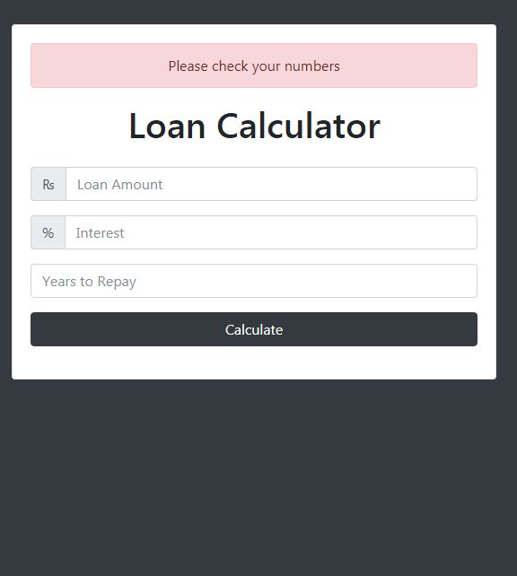

# Loan Calculator

Live on - https://shomikg.github.io/LoanCalculator/
A small web application developed to calculate minimum monthly payments in rupees to meet specified interest rate and number of repayment years.

## Technologies Used in this repo

* JavaScript ES6: plain JS (as opposed to jQuery, etc.) is used to dynamically query, create, modify, and remove HTML elements/nodes
* Node.js: basic web server
* Bootstrap: front-end CSS/JS framework

## Features

1. A loading GIF is displayed after a user submits the form. This enhances the user experience (ever so slightly) as it informs the user that some kind of processing is occurring.

2. Form validation checks user input by using JavaScript's isFinite() method. If, during calculation, an issue arises with any intermediate value, using isFinite() verifies this scenario and displays an error message at the top.

   

## Thoughts

The setTimeout() method of the **window** object is a great, simple tool. In this project, it was used several times to hide and show DIVs at designated intervals.
